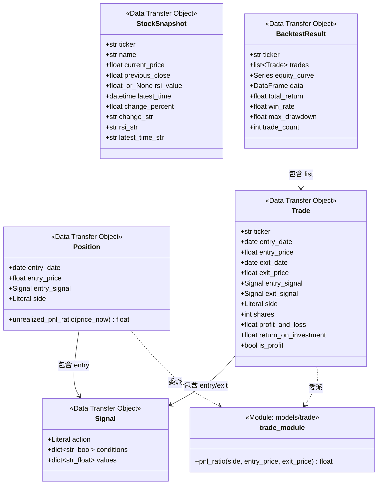
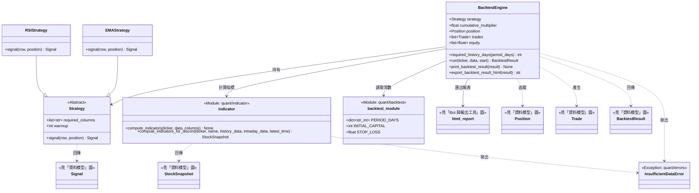
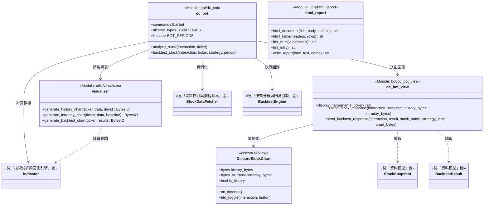
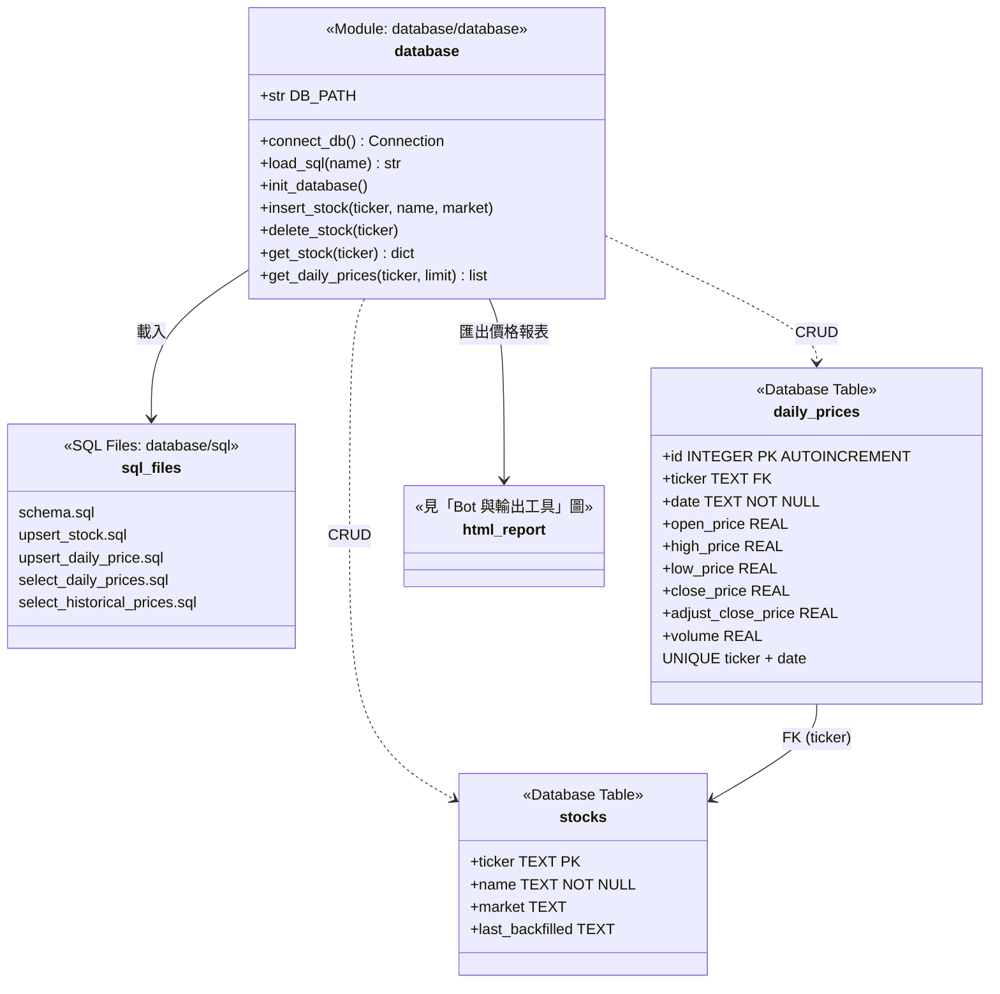
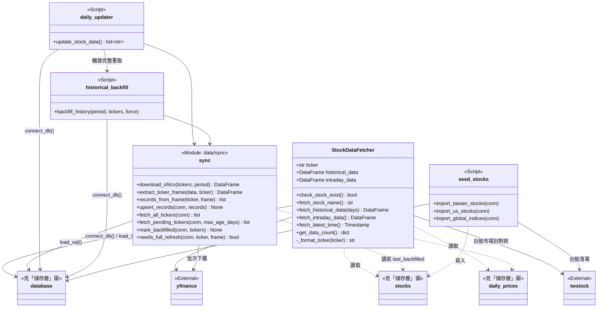
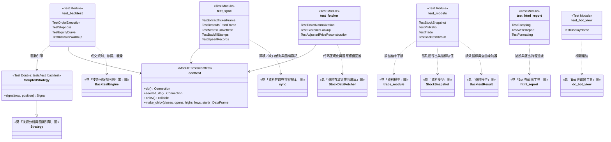

# 模組相依關係

依目錄結構拆成 6 張圖，呈現類別與模組間的相依方向。

完整簽章、參數語意與行為規則見 [ARCHITECTURE.md](./ARCHITECTURE.md)。

跨圖引用以 `<<見「X」圖>>` 標註，僅保留關聯線。

## 1. 資料模型 (`src/models/`)

## 2. 技術分析與回測引擎 (`src/quant/`)

引擎不相依於任何資料來源，`run()` 接收呼叫端備妥的 DataFrame。

## 3. Bot 與輸出工具 (`src/bot/`、`src/utils/`)

`html_report` 不相依於 Discord，其使用者為 `BacktestEngine` 與 `database`；列於此圖僅因同屬 `src/utils/`。

## 4. 儲存層 (`src/database/`)

## 5. 資料存取與排程腳本 (`src/data/`、`scripts/`)

`fetcher` 為讀取門面，`sync` 為寫入路徑，三支腳本一律經由 `sync` 寫入。

## 6. 測試 (`tests/`)

同時作為覆蓋範圍對照。

